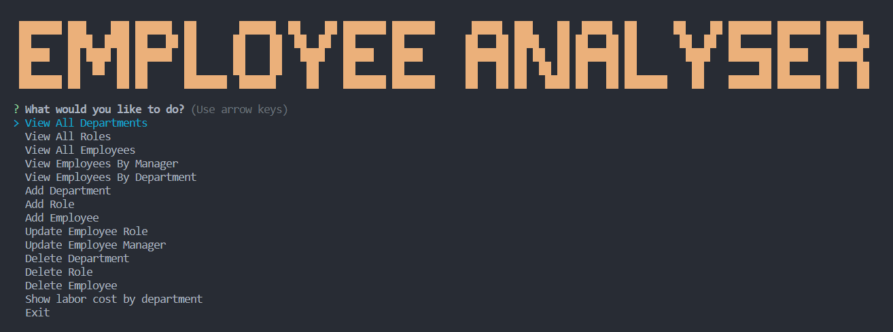
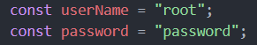

# Employee Analyser

## Description

This is a simple CLI based content management system that performs CRUD operations on a dynamically generated test database. This application uses, Node.js, Inquirer.js, CLI-Table3, Faker.js, MySQL, and the MySQL2  node module. This application will generate and seed the database dynamically when running "NPM Install" from the command-line.

Installation instruction video and demo: [Link to video.](https://drive.google.com/file/d/1CNvxe2JovI9bKZp8QBNIzs20p3YDzNGu/view?usp=sharing)

Node can be installed directly from [https://nodejs.org/en](https://nodejs.org/en).

MySQL can be installed directly from [https://www.mysql.com/downloads/](https://www.mysql.com/downloads/)

All other node packages can be installed by using "npm install" from command-line when in the applications root directory.

This was a project during the Full Stack Web Development Bootcamp at UC Berkeley Ext.

#### Application Features:

* **View All Departments** : Easily access a list of all departments in your company, organized and displayed in a clear format.
* **View All Roles** : Gain insights into various job roles within your organization, including titles, departments, and corresponding salaries.
* **View All Employees** : Effortlessly view essential employee data, such as names, job titles, departments, salaries, and reporting managers.
* **View Employees By Manager** : Get a comprehensive overview of employees grouped by their respective managers, facilitating better team management.
* **View Employees By Department** : Quickly access a comprehensive list of employees categorized by their departments, simplifying workforce analysis.
* **Add Department** : Seamlessly expand your company's structure by adding new departments through intuitive prompts.
* **Add Role** : Effortlessly introduce new roles to your organization, specifying titles, salaries, and the relevant department.
* **Add Employee** : Streamline the hiring process by adding new employees with their first name, last name, role, and manager details.
* **Update Employee Role** : Empower effective role transitions within your company by updating an employee's role with ease.
* **Update Employee Manager** : Facilitate managerial changes effortlessly by updating an employee's reporting manager.
* **Delete Department** : Efficiently manage your organizational structure by removing obsolete or redundant departments.
* **Delete Role** : Optimize your job roles by deleting outdated or unnecessary positions from the system.
* **Delete Employee** : Seamlessly manage your workforce by removing employee data when required.
* **Show Labor Cost by Department** : Get a clear picture of labor costs in each department, assisting with budgeting and resource allocation decisions.

#### Main Menu Photo:

## Installation

For Development:

1. Clone or fork the repository using "git@github.com:MeanBean87/employee-tracker.git"
2. Navigate to the root directory of the project using CLI.
3. Install node modules using "npm install"

**MySQL and Node.js will need to be installed by the user.**

Link to MySQL Downloads: [https://www.mysql.com/downloads/](https://www.mysql.com/downloads/)

Link to Node.js Downloads: [https://nodejs.org/en](https://nodejs.org/en)

## Usage

Installation video: [https://drive.google.com/file/d/1CNvxe2JovI9bKZp8QBNIzs20p3YDzNGu/view?usp=sharing](https://drive.google.com/file/d/1CNvxe2JovI9bKZp8QBNIzs20p3YDzNGu/view?usp=sharing)

1. Clone the repository from "git@github.com:MeanBean87/employee-tracker.git"
3. Navigate to the root directory of the application
4. Open folder "config" then edit dbConfig.js update these userName and password variables to use your username and password for MySQL, note the users that will be using this application will need to have the appropriate permissings.

   
5. Run "npm install" from the command-line.
6. Start the application with "node server.js" or "npm start" from the command-line while in the root directory.
7. Navigate the menu to perform CRUD operations on the MySQL database.
8. For create, update, or delete operations follow the prompts. When using read operations you will be presented with a table of the desired information.
9. You will then be given an option to return to the main menu or exit the application.
10. Return to the main menu to perform more actions, select exit to close the connection to MySQL and exit the application.

## Code Highlights

Code snippet of the generateLaborCostReport function that shows the cost of labor per department.

```
const generateLaborCostReport = async () => {
  try {
    const query = `SELECT d.id AS department_id,
    d.name AS department_name,
    SUM(COALESCE(r.salary, 0)) AS labor_cost
    FROM departments d
    LEFT JOIN roles r ON d.id = r.department_id
    LEFT JOIN employees e ON r.id = e.role_id
    GROUP BY d.id, d.name
    ORDER BY d.id ASC;`;

    const [laborCostReport] = await pool.query(query);
    process.stdout.write("\x1B[2J\x1B[0f");
    showTable(
      ["Department ID", "Department Name", "Labor Cost"],
      laborCostReport
    );
  } catch (err) {
    console.error("Error occurred while fetching employees:", err);
  }
};
```

## Learning Points

Building MySQL Databases, Tables, and seeding information inside of those tables. Using inquire to use functions to perform CRUD operations. Using faker.js to generate dynamic content to be used as seeds. And using cli-table3 to display table data on the command-line.

## Badges

       

## Author

Michael Mattingly

* [GitHub](https://github.com/MeanBean87)
* [LinkedIn](https://www.linkedin.com/in/michael-mattingly-5580b1280/)

This project was created with source code provided from UC Berkeley Extension.

This project uses the following packages:

* Node.js - [https://nodejs.org/en](https://nodejs.org/en)
* MySQL - [https://www.mysql.com/](https://www.mysql.com/)
* MySQL2 - [https://www.npmjs.com/package/mysql2](https://www.npmjs.com/package/mysql2)
* Inquirer - [https://www.npmjs.com/package/inquirer](https://www.npmjs.com/package/inquirer)
* Faker.js - [https://fakerjs.dev/](https://fakerjs.dev/)
* Cli-table3 - [https://www.npmjs.com/package/cli-table3](https://www.npmjs.com/package/cli-table3)

## License

This project is licensed under the [MIT License](https://github.com/MeanBean87/readme-generator/blob/main/LICENSE). Please refer to the LICENSE file for more details.
